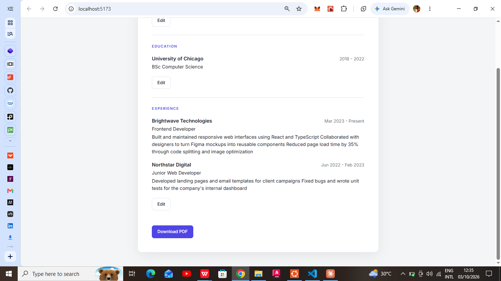

# CV Application

A responsive CV builder where you fill in your details, save them into a clean, document-style CV, and export the result as a PDF. 

**[Live demo](https://cv-application-seven-lovat.vercel.app/)** · **[Source code](https://github.com/Dee-pack/cv-application.git)**


## Features

- **Three sections:** general information, education, and work experience
- **Edit and save:** each section switches between a form and a formatted display. Clicking Edit brings the form back with your previous values filled in.
- **Multiple entries:** add or remove as many schools and jobs as you need
- **Download as PDF:** exports a clean, print-ready version with buttons and background removed
- **Responsive:** works on desktop and mobile

## Built with

- [React](https://react.dev/) (hooks: `useState`)
- [Vite](https://vite.dev/)
- Plain CSS with custom properties (variables), no UI library

## What I practiced

- Managing state with `useState`, using one object for single entries and an array of objects for lists
- Controlled inputs, with a single `handleChange` driven by each input's `name` attribute
- Updating state immutably with `map`, `filter` and the spread operator
- Conditional rendering to toggle between edit and display views
- Splitting the UI into components
- Styling with CSS variables and `@media print` for the PDF output

## Run it locally

```bash
git clone https://github.com/Dee-pack/cv-application.git
cd cv-application
npm install
npm run dev
```

Then open http://localhost:5173.

## Project structure

```
src/
├── components/
│   ├── GeneralInfo.jsx
│   ├── Education.jsx
│   └── Experience.jsx
├── styles/
│   ├── index.css
│   └── sections.css
├── App.jsx
└── main.jsx
```

## Possible improvements

- Save data to `localStorage` so it persists after refresh
- Add a skills section and a profile summary
- Multiple CV templates or colour themes
- Extract the shared add/remove/update logic into a custom hook

## Author

**[Your Name]** · [GitHub](https://github.com/Dee-pack) · [LinkedIn](https://linkedin.com/in/your-handle)
